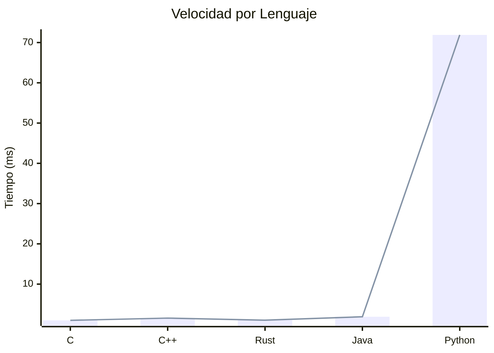
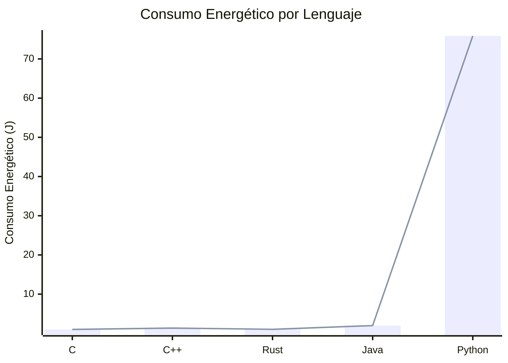
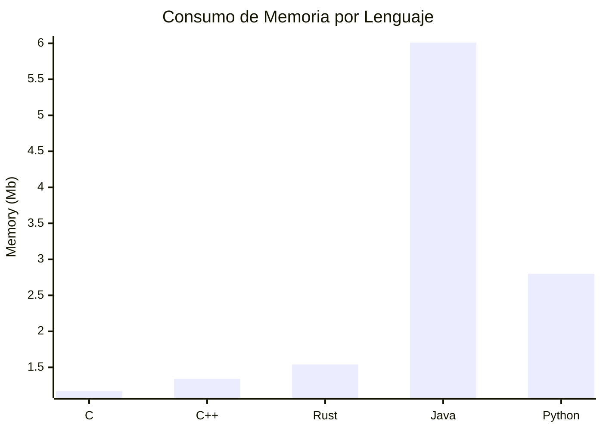
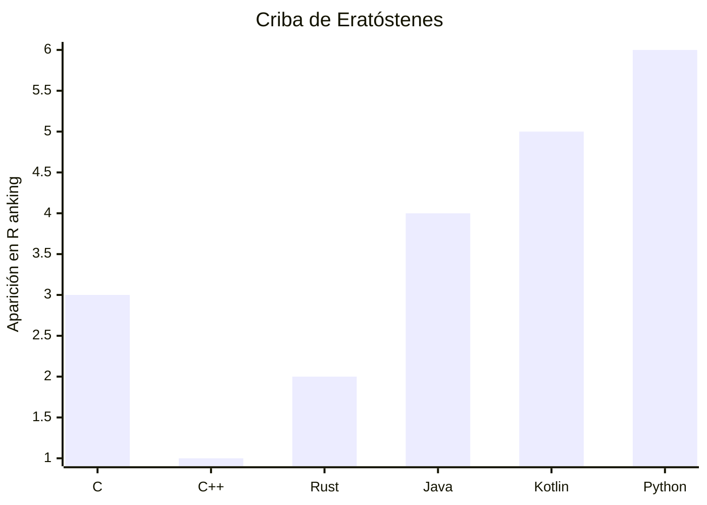

__Tabla de Contenidos:__
* 
{:toc} 

## ¿Qué es C++?

C++ es un lenguaje compilado de alto nivel inventado por Bjarne Stroustrup en 1979 para extender la funcionalidad de C, incorporando el paradigma de la programación orientada a objetos a través de clases. Su ventaja sobre otros lenguajes radica en su velocidad y en la amplia funcionalidad gracias a funciones y algoritmos integrados en la librería estandard STL . Está entre en los 3 lenguajes más populares según [TIOBE](https://www.tiobe.com/tiobe-index/) 


## ¿Qué buscamos de un lenguaje de programación?

1. Presencia en plataformas y competencias
1. Velocidad de ejecución 
1. Funciones, algoritmos, estructuras de datos en la librería estándar
1. Sintaxis y velocidad de Entrada/Salida (I/O)

## 1. Presencia en plataformas y competencias

- Lenguajes permitidos en Codeforces

    - C, C++, C#, D, Go, Haskell, Java, Kotlin, OCaml, Delphi, Pascal, Perl, PHP, Python, Ruby, Rust, Scala, JavaScript y Node.js

- Lenguajes permitidos en el ICPC
    - C, C++, Java, Kotlin y Python

### Comparación de Lenguajes permitidos

| Lenguaje | Ventajas | Desventajas |
| -------- | -------- | ----------- |
| **Java** | - Gestión de memoria automática <br> - Gran cantidad de librerías | - Consumo alto de memoria  <br> - E/S lenta <br> - Sintaxis extensa y por clases |
| **Kotlin** | - Sintaxis moderna y concisa <br> - Interoperabilidad con Java | - Comunidad y recursos más limitados <br> |
| **Python3** | - Sintaxis simple y legible <br> - Gran cantidad de librerías | - Lento en la ejecución <br> - Gestión de memoria no tan eficiente |
| **C** | - Muy rápido y eficiente en términos de rendimiento <br> - Soporta el uso de Macros y Alias | - Manejo de memoria manual <br> - Sin varias estructuras de datos |
| **C++** | - Muy rápido y eficiente <br> - Amplia biblioteca estándar STL <br> - Interoperabilidad con C | - Complejidad en la gestión de memoria <br> - Curva de aprendizaje pronunciada <br> |

## 2. Velocidad de ejecución 

### Resultados normalizados de velocidad y consumo por lenguaje
- por Pereiraa, R. et al.






---

### Ranking de velocidad por lenguaje ejecutando el algoritmo de la criba de Eratóstenes
- por Plummer, D.



## 3. Funciones, algoritmos, estructuras de datos en la librería estándar

- **C**
  - **Estructuras de datos**: Arreglos (vectores) y cadenas. No incluye estructuras de datos avanzadas.
  - **Algoritmos**: No incluye algoritmos, la implementación de cada uno es manual.

- **C++**
  - **Estructuras de datos**: `vector`, `list`, `map`, `set`, `stack`, `queue`, etc.
  - **Algoritmos**: `sort`, `find`, `binary_search`, entre otros.

- **Rust**
  - **Estructuras de datos**: `Vec`, `LinkedList`, `HashMap`, `BTreeMap`, `HashSet`, `BTreeSet`. No tiene `stack` ni `queue` específicos, pero se pueden implementar.
  - **Algoritmos**: `sort`, `iter`, `filter`, `map`, entre otros.

- **Java**
  - **Estructuras de datos**: `ArrayList`, `LinkedList`, `HashMap`, `TreeMap`, `HashSet`, `TreeSet`, `Stack`, `PriorityQueue`.
  - **Algoritmos**: `sort`, `binarySearch`, `shuffle`, entre otros.

- **Kotlin**
  - **Estructuras de datos**: `List`, `MutableList`, `Map`, `MutableMap`, `Set`, `MutableSet`. No tiene `stack` ni `queue` específicos, pero se pueden implementar.
  - **Algoritmos**: `sort`, `filter`, `map`, `reduce`, entre otros.

- **Python3**
  - **Estructuras de datos**: `list`, `tuple`, `dict`, `set`, `frozenset`, `deque` (para `stack` y `queue`).
  - **Algoritmos**: `sorted`, `map`, `filter`, `reduce`, `heapq`, `bisect`, entre otros.

## 4. Sintaxis y velocidad de Entrada/Salida (I/O)

### C

```c
#include <stdio.h>
int main() {
    int n;
    scanf("%i", &n); // Entrada de n
    printf("%i",n);  // Salida de n
    return 0;
}

```

#### con buffers

```c
#include <stdio.h>
int main() {
    char buffer[1000];
    int n;
    snprintf(buffer, sizeof(buffer), "%d\n", n); // entrada de n
    fputs(buffer, stdout);                       // Salida de n
    return 0;
}

```

### C++
```c++
#include <bits/stdc++.h>
using namespace std;
int main(){
    ios::sync_with_stdio(0); cin.tie(0);
    int n; 
    cin >> n;  // entrada de n
    cout << n; // Salida de n
    return 0;
}

```

### Rust

```rust
use std::io::{self, BufRead, Write, BufWriter};
fn main() -> io::Result<()> {
    let stdin = io::stdin();
    let stdout = io::stdout();
    let mut stdout = BufWriter::new(stdout.lock());
    let mut input = String::new();
    stdin.lock().read_line(&mut input).unwrap();
    let n: i32 = input.trim().parse().unwrap(); // entrada de n
    writeln!(stdout, "{}", n)?;         // salida de n
    Ok(())
}
```


### Java
#### con `BufferedReader` y `PrintWriter`

```java
import java.io.*;
import java.util.*;
public class Main {
	public static void main(String[] args) throws Exception {
            BufferedReader br = new BufferedReader(new InputStreamReader(System.in));
            PrintWriter pw = new PrintWriter(System.out);
            StringTokenizer st = new StringTokenizer(br.readLine());
            int n = Integer.parseInt(st.nextToken());  // entrada de n
            pw.println(n);                             // salida de n
            pw.close();
	}
}
```

#### con `BufferedReader` y `BufferedOutputStream`

```java
import java.io.*;
import java.util.*;
public class Main {
    public static void main(String[] args) throws Exception {
            BufferedReader br = new BufferedReader(new InputStreamReader(System.in));
            BufferedOutputStream bos = new BufferedOutputStream(System.out);
            StringTokenizer st = new StringTokenizer(br.readLine());
            int n = Integer.parseInt(st.nextToken());  // entrada de n
            bos.write((n + "\n").getBytes());          // salida de n
            bos.close();
    }
}

```

#### más veloz pero más código con `InputStream` 

```java
import java.io.*;
import java.util.*;
class FastIO extends PrintWriter {
	private InputStream stream;
	private byte[] buf = new byte[1 << 16];
	private int curChar;
	private int numChars;
	public FastIO() { this(System.in, System.out); }
	public FastIO(InputStream i, OutputStream o) { super(o); stream = i; }
	public FastIO(String i, String o) throws IOException { 
        super(new FileWriter(o)); stream = new FileInputStream(i); }
	private int nextByte() { 
		if (numChars == -1) { throw new InputMismatchException(); }
		if (curChar >= numChars) { curChar = 0;
			try { numChars = stream.read(buf); }
            catch (IOException e) { throw new InputMismatchException(); }
			if (numChars == -1) { return -1; } }
		return buf[curChar++]; }
	public String next() { int c; 
		do { c = nextByte(); } while (c <= ' ');
		StringBuilder res = new StringBuilder();
		do {
			res.appendCodePoint(c);
			c = nextByte();
		} while (c > ' ');
		return res.toString();
	}
	public int nextInt() {  
		int c;
		do { c = nextByte(); } while (c <= ' ');
		int sgn = 1;
		if (c == '-') { sgn = -1; c = nextByte(); }
		int res = 0;
		do { 
			if (c < '0' || c > '9') { throw new InputMismatchException(); }
			res = 10 * res + c - '0'; c = nextByte();
		} while (c > ' ');
		return res * sgn;
	}
	public double nextDouble() { return Double.parseDouble(next()); }
}
public class Main {
	public static void main(String[] args) throws Exception {
            FastIO io = new FastIO();
            int n = io.nextInt(); // entrada de n
            io.println(n);        // salida de n 
            io.close();
	}
}
```

### Kotlin

```kotlin
import java.io.*
import java.util.*
@JvmField val writer = PrintWriter(System.out)
@JvmField val reader = BufferedReader(InputStreamReader(System.`in`))
@JvmField var tokenizer = StringTokenizer("")
private fun read(): String {
    while (!tokenizer.hasMoreTokens()) {
        tokenizer = StringTokenizer(reader.readLine())
    }
    return tokenizer.nextToken()
}
fun main() { 
    var n = read().toInt() // entrada de n
    writer.println(n)       // salida de n
    writer.flush()          
}  
````

### Python3

```py
import sys
read = sys.stdin.readline
write = sys.stdout.write
def main():
    n = int(read()) # entrada de n
    write(f"{n}\n") # salida de n

if __name__ == "__main__":
    main()
```

## Conclusión

Usamos C++ debido a que cumple con las cuatro criterios que propusimos para un lenguaje eficiente y versátil, C++ cuenta con presencia en todas las plataformas y Competencias donde ofrece una de las mejores velocidades de ejecución y eficiencia energética entre los lenguajes permitidos. 

La librería estándar STL de C++ es uno de los proporciona una amplia gama de estructuras de datos y algoritmos eficientes, lo que facilita la implementación de soluciones complejas sin necesidad de bibliotecas adicionales.
Aunque la sintaxis de C++ puede ser más compleja en comparación con python, sigue siendo más concisa que la de Java por ejemplo. Su capacidad para manejar operaciones de entrada y salida de manera eficiente, evitaran tener un TLE (Time Limit Exceeded).

En resumen, la combinación de velocidad, amplia funcionalidad, y la capacidad de integración hace de C++ una elección muy fuerte y efectiva para distintas aplicaciones, desde programación competitiva hasta desarrollo de software a gran escala.


## Referencias

- akhaleqh. (2024). *Rust vs C++ – Will Rust Replace C++ in Future*. Recuperado de <https://www.geeksforgeeks.org/rust-vs-c/>
- Back, G. (2021).  *Fast I/O in Rust*. Recuperado de <https://users.rust-lang.org/t/fast-i-o-in-rust/61714/4>
- Behery, A. (2023). *Python VS C++ Time Complexity Analysis*. Recuperado de <https://www.freecodecamp.org/news/python-vs-c-plus-plus-time-complexity-analysis/>
- CodingKnight. (2021). *Fast data input-output for competitive programming in Java 11*. Recuperado de <https://codeforces.com/blog/entry/97203>
- conaticus. (2024). *Rust vs C++* [video]. Recuperado de <https://youtu.be/WBhTDoZxpCk?si=iBzTj5IK3P9aFYch>
- Coursera. (2023). *Python vs. C++: Which to Learn and Where to Start*. Recuperado de <https://www.coursera.org/articles/python-vs-c>
- Dave's Garage. (2021). *E01: What is the FASTEST Computer Language? 45 Languages Tested!* [video]. Recuperado de <https://youtu.be/tQtFdsEcK_s?si=LHBb6MYXniUwGGnB>
- DevExplain. (2023). *Rust vs C++ / Which is Better?* [video]. Recuperado de <https://youtu.be/qhXu2Q_Fq5I?si=q_DTLlzgSeMmtXUg>
- Ebtekar, A. (2019). *How to Compete in Rust*. Recuperado de <https://codeforces.com/blog/entry/67391?mobile=true>
- fasterthanlime. (2023). *10 Reasons Not To Use Rust (The Whole Truth)* [video]. Recuperado de <https://youtu.be/ul9vyWuT8SU?si=pJNz_i3WzJPnM9Rv>
- fasterthanlime. (2023). *C++ vs Rust: which is faster?* [video]. Recuperado de <https://youtu.be/VMpSYJ_7aYM?si=IjIDgD2bQrA6lLNw>
- GeeksforGeeks. (2024). *C++ Programming Language*. Recuperado de <https://www.geeksforgeeks.org/c-plus-plus/>
- Ghosh, K. (2020). *Ways for Fast Input / Output in Python*. Recuperado de <https://codeforces.com/blog/entry/83441>
- ICPC. (2024). *2024 ICPC World Finals Rules - Astana*. Recuperado de <https://icpc.global/worldfinals/rules>
- Jecky. (2024). *Rust vs C++: Top Differences*. Recuperado de <https://www.geeksforgeeks.org/rust-vs-cpp/>
- JetBrains. (2020). *Kotlin for Competitive Programming. Interview with Nick Johnson, ICPC Participant* [video]. Recuperado de <https://youtu.be/eykFs9jBznc?si=SK9e-1ReuMp1MTZb>
- Klunk, E. (2015). *Why does the Java programming language suck so bad?* [video]. Recuperado de <https://youtu.be/lBF1SOQ1-xw?si=8MVHRzVqBrouWbVe>
- Kotlin. (2023). *Kotlin for competitive programming*. Recuperado de <https://kotlinlang.org/docs/competitive-programming.html>
- Kumar,A. (2024). *Top 5 most energy efficient coding languages*. Recuperado de <https://wireunwired.com/top-5-most-energy-efficient-coding-languages/>
- Low Level Learning. (2022). *the TRUTH about C++ (is it worth your time?)* [video]. Recuperado de <https://youtu.be/q1ZmFc-sqNc?si=yzDhH3dhqDl5NSmJ>
- Low Level Learning. (2023). *C is 50 Years Old. Should You Learn Rust?* [video]. Recuperado de <https://youtu.be/NtYHC1KNGoc?si=H7MBZAnGAPLraSOc>
- Mahrsee, R. (2022). *Fast I/O in Java in Competitive Programming*. Recuperado de <https://www.geeksforgeeks.org/fast-io-in-java-in-competitive-programming/>
- No Boilerplate. (2022). *Rust is not a faster horse* [video]. Recuperado de <https://youtu.be/4YU_r70yGjQ?si=zw34i1CI0CEjaggS>
- Pandey, U. (2022). *Java Generics to Code Efficiently in Competitive Programming*. Recuperado de <https://www.geeksforgeeks.org/java-generics-to-code-efficiently-in-competitive-programming/>
- Pereiraa, R. et al. (2017). *Energy Efficiency across Programming Languages*. Recuperado de <https://greenlab.di.uminho.pt/wp-content/uploads/2017/10/sleFinal.pdf>
- Pereiraa, R. et al. (2021). *Ranking Programming Languages by Energy Efficiency*. Recuperado de <https://www.smallake.kr/wp-content/uploads/2022/09/scp21.pdf>
- Plummer, D. (2024). *Primes report generated by davepl at 3/8/2024 03:21:28*. Recuperado de <https://plummerssoftwarellc.github.io/PrimeView/report?id=5740&hi=False&hf=False&hp=False&fi=&fp=&fa=&ff=&fb=&tp=False&sc=pp&sd=True>
- Programming Memes. (2022). *Python vs C++ vs C# Speed Comparison* [video]. Recuperado de <https://youtu.be/u7fpOY29Gxc?si=ph3fiA6w0eVe8NYH>
- Qi, B. & Chen, N. (s.f.). *Fast Input & Output*. Recuperado de <https://usaco.guide/general/fast-io?lang=cpp>
- Qi, B. & Chen, N. (s.f.). *Fast Input & Output*. Recuperado de <https://usaco.guide/general/fast-io?lang=java>
- Qi, B. & Chen, N. (s.f.). *Fast Input & Output*. Recuperado de <https://usaco.guide/general/fast-io?lang=py>
- Sanghvi, N. (2022). *Why C++ is best for Competitive Programming?*. Recuperado de <https://www.geeksforgeeks.org/why-cpp-is-best-for-competitive-programming/>
- Spheniscine. (2019). *Notes on using Kotlin for competitive programming*. Recuperado de <https://codeforces.com/blog/entry/71089>
- The builder. (2022). *Python vs C++ Speed Comparison* [video]. Recuperado de <https://www.youtube.com/watch?v=VioxsWYzoJk>
- thekushalghosh. (2020). *Fast I/O for Competitive Programming in Python*. Recuperado de <https://www.geeksforgeeks.org/fast-i-o-for-competitive-programming-in-python/>
- Tom Rocks Maths. (2019). *Why is Kotlin better than Java?* [video]. Recuperado de <https://youtu.be/4-2oRI4OrUg?si=obVRsyXSXowZNe_X>
- Wikipedia Editors. (2024). *Criticism of Java*. Recuperado de <https://en.wikipedia.org/wiki/Criticism_of_Java>