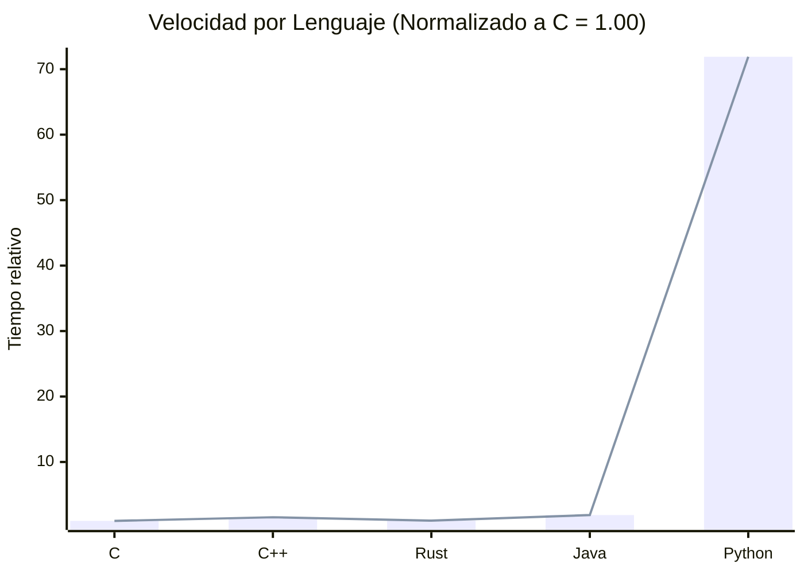
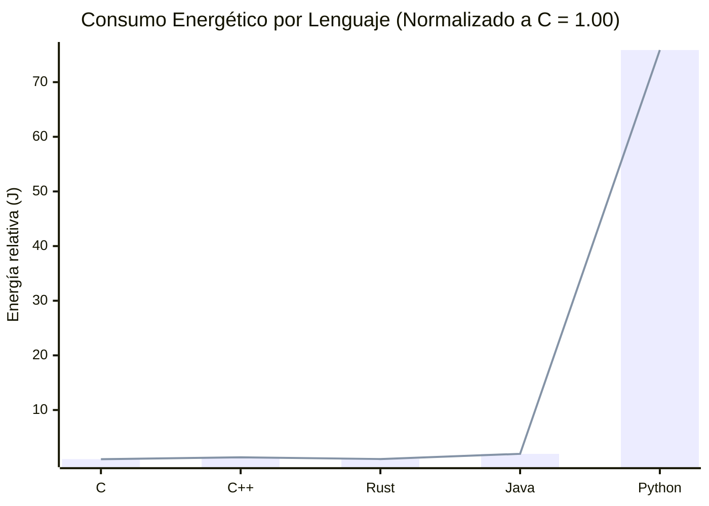
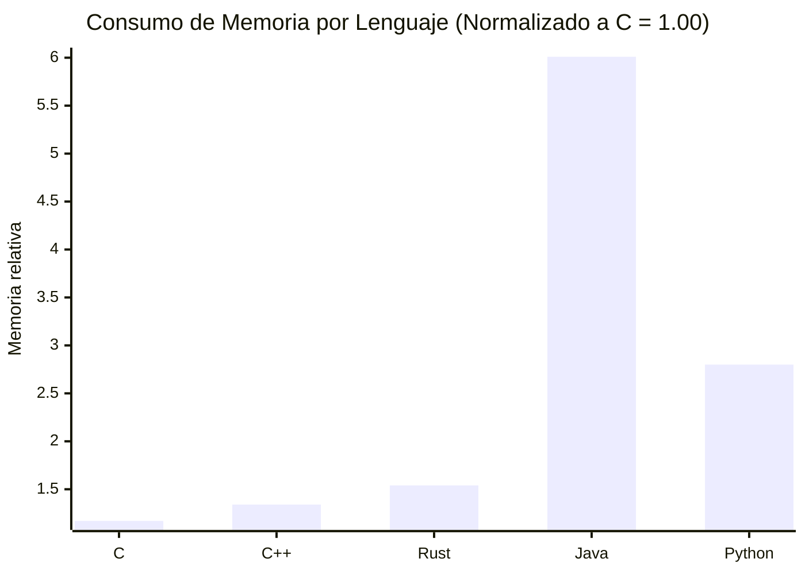
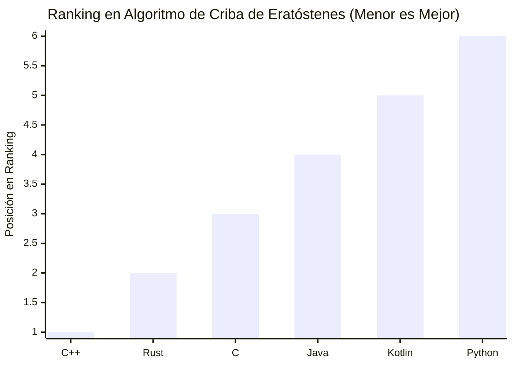

__Tabla de Contenidos:__
* TOC
{:toc} 

## ¿Qué es C++?

C++ es un lenguaje de programación compilado de propósito general y alto rendimiento creado por [Bjarne Stroustrup](https://www.stroustrup.com/) en 1979 como una extensión de C para incorporar el paradigma orientado a objetos. Su enorme ventaja en el ámbito del desarrollo de sistemas y la programación competitiva radica en su velocidad de ejecución cercana al metal, su modelo de memoria determinista sin recolección de basura (*Garbage Collector*) y la inmensa versatilidad de su biblioteca estándar ([STL](https://en.cppreference.com/w/cpp)). Es uno de los lenguajes más utilizados y populares a nivel mundial según índices como [TIOBE](https://www.tiobe.com/tiobe-index/).

En el club [CPC Gallos](https://github.com/CPC-GALLOS), así como en nuestro [Team Reference Document (TRD / Notebook)](https://github.com/CPC-GALLOS/Notebook), utilizamos C++ de forma exclusiva. En este artículo profundizamos en las razones técnicas, empíricas y prácticas detrás de esta elección.

---

## ¿Qué buscamos de un lenguaje de programación?

En la programación competitiva (ICPC, IOI, Codeforces, AtCoder, CSES) y en sistemas de alto rendimiento, un lenguaje ideal debe cumplir con criterios fundamentales:

1. **Presencia universal en plataformas y competencias oficiales**.
2. **Velocidad de ejecución nativa y sobrecarga mínima de memoria (*Zero GC/VM Overhead*)**.
3. **Biblioteca estándar rica (STL) y extensiones avanzadas del compilador (PBDS)**.
4. **Sintaxis concisa y velocidad extrema de Entrada/Salida (Fast I/O)**.
5. **Acceso a operaciones de bajo nivel: Intrínsecos de bits en hardware y tipos de 128 bits (`__int128`)**.
6. **Previsibilidad en el presupuesto de tiempo y memoria ($1.0\text{s} \approx 10^8\text{ ops} \mid 256\text{MB}$)**.

---

## 1. Presencia en plataformas y competencias

El soporte de un lenguaje varía entre diferentes jueces en línea y competencias presenciales:

- **Lenguajes permitidos en [Codeforces](https://codeforces.com/):**
  - C, C++, C#, D, Go, Haskell, Java, Kotlin, OCaml, Delphi, Pascal, Perl, PHP, Python, Ruby, Rust, Scala, JavaScript y Node.js.
- **Lenguajes permitidos en el [ICPC](https://icpc.global/worldfinals/rules):**
  - C, C++, Java, Kotlin y Python.

A pesar de que plataformas online aceptan decenas de opciones, en competencias oficiales como el ICPC y la IOI el catálogo se reduce drásticamente. C++ es el único lenguaje que cuenta con soporte garantizado y de primera clase en el 100% de los entornos competitivos mundiales.

### Comparación de Lenguajes Permitidos

| Lenguaje     | Ventajas                                                                                                                                                                               | Desventajas                                                                                                                                            |
| :----------- | :------------------------------------------------------------------------------------------------------------------------------------------------------------------------------------- | :----------------------------------------------------------------------------------------------------------------------------------------------------- |
| **Java**     | - Gestión automática de memoria.<br>- Amplia biblioteca de clases.                                                                                                                     | - Alto consumo de memoria (sobrecarga de objetos).<br>- I/O por defecto lento.<br>- Pausas imprevistas por *Garbage Collector*.<br>- Sintaxis verbosa. |
| **Kotlin**   | - Sintaxis concisa y moderna.<br>- Interoperabilidad total con la JVM.                                                                                                                 | - Comparte la sobrecarga de memoria de la JVM.<br>- Comunidad y recursos más reducidos en CP.                                                          |
| **Python 3** | - Sintaxis simple, rápida de tipear y muy legible.<br>- Soporte nativo para enteros de precisión arbitraria (`BigInt`).                                                                | - Ejecución sumamente lenta ($\approx 70\times$ más lento que C++).<br>- Alto riesgo de TLE en problemas con $N \ge 10^5$.                             |
| **C**        | - Extremadamente rápido y bajo nivel.<br>- Sin sobrecarga de abstracciones.                                                                                                            | - Carece de estructuras de datos estándar (no tiene `vector`, `set`, `map`, `sort` genérico).<br>- Requiere implementar todo desde cero.               |
| **Rust**     | - Rendimiento equivalente a C++.<br>- Seguridad de memoria en tiempo de compilación.                                                                                                   | - No admitido en el ICPC ni IOI.<br>- Curva de aprendizaje y sintaxis estricta para código rápido en competencias.                                     |
| **C++**      | - Rendimiento nativo máximo.<br>- Enorme biblioteca STL y extensiones GCC ([PBDS](https://codeforces.com/blog/entry/11080)).<br>- Tipos nativos de 128 bits e intrínsecos de hardware. | - Gestión manual de memoria.<br>- Mensajes de error del compilador complejos.                                                                          |

---

## 2. Velocidad de ejecución y consumo de memoria (Zero GC / VM Overhead)

Una de las mayores ventajas de C++ es que compila directamente a código máquina nativo para la arquitectura destino (x86-64 o ARM), sin la intervención de máquinas virtuales (como la JVM de Java y Kotlin) ni de intérpretes (como CPython).

### Cero Pausas de Recolección de Basura (*Garbage Collector*)

En lenguajes con recolección de basura (Java, Kotlin, Python), el *Garbage Collector* puede activarse de forma impredecible durante la ejecución de un algoritmo intensivo, generando pausas que transforman un veredicto aceptado (**AC**) en un tiempo límite excedido (**TLE**). 

Además, en Java y Kotlin cada objeto instanciado (como los nodos de un árbol, entradas de mapas o pares) acarrea una cabecera de objeto (*object header*) de 16 a 24 bytes. Esto significa que una estructura de datos con $4 \times 10^6$ elementos puede consumir más de 200MB en la JVM, rozando el límite estándar de 256MB. En contraste, en C++ los arreglos y `std::vector` almacenan tipos primitivos de forma contigua en memoria sin sobrecarga oculta, lo que garantiza una óptima **localidad espacial en la memoria caché del procesador** (*cache locality*).

### Resultados empíricos de velocidad y consumo por lenguaje

De acuerdo con el estudio de [Pereira et al. (2017)](https://greenlab.di.uminho.pt/wp-content/uploads/2017/10/sleFinal.pdf) y [Pereira et al. (2021)](https://www.smallake.kr/wp-content/uploads/2022/09/scp21.pdf), C y C++ lideran consistentemente los benchmarks de tiempo de ejecución y eficiencia energética:


```mermaid
xychart-beta
    title "Velocidad por Lenguaje (Normalizado a C = 1.00)"
    x-axis ["C", "C++", "Rust", "Java", "Python"]
    y-axis "Tiempo relativo"
    bar [1.00, 1.56, 1.04, 1.89, 71.90]
    line [1.00, 1.56, 1.04, 1.89, 71.90]
```


```mermaid
xychart-beta
    title "Consumo Energético por Lenguaje (Normalizado a C = 1.00)"
    x-axis ["C", "C++", "Rust", "Java", "Python"]
    y-axis "Energía relativa (J)"
    bar [1.00, 1.34, 1.03, 1.98, 75.88]
    line [1.00, 1.34, 1.03, 1.98, 75.88]
```


```mermaid
xychart-beta
    title "Consumo de Memoria por Lenguaje (Normalizado a C = 1.00)"
    x-axis ["C", "C++", "Rust", "Java", "Python"]
    y-axis "Memoria relativa"
    bar [1.17, 1.34, 1.54, 6.01, 2.80]
```

---

### Benchmark: Criba de Eratóstenes

En el benchmark de [Dave Plummer (2021)](https://youtu.be/tQtFdsEcK_s) sobre la implementación de la criba de Eratóstenes en más de 45 lenguajes ([Dave's Garage Report](https://plummerssoftwarellc.github.io/PrimeView/report?id=5740&hi=False&hf=False&hp=False&fi=&fp=&fa=&ff=&fb=&tp=False&sc=pp&sd=True)), C++ se ubicó en la cima absoluta de velocidad de cálculo:


```mermaid
xychart-beta
    title "Ranking en Algoritmo de Criba de Eratóstenes (Menor es Mejor)"
    x-axis ["C++", "Rust", "C", "Java", "Kotlin", "Python"]
    y-axis "Posición en Ranking"
    bar [1, 2, 3, 4, 5, 6]
```

---

## 3. Biblioteca Estándar (STL) y Extensiones GCC (PBDS)

La riqueza de estructuras de datos listas para usar en tiempo de concurso es decisiva. Mientras que en C no existen estructuras dinámicas integradas y en Java algunas interfaces requieren escribir excesivo código repetitivo (*boilerplate*), C++ ofrece la [Standard Template Library (STL)](https://en.cppreference.com/w/cpp/container).

### Estructuras y Algoritmos en la STL

- **Contenedores lineales y adaptadores:** `std::vector`, `std::deque`, `std::stack`, `std::queue`, `std::priority_queue` (montículo binario de acceso $O(1)$ al elemento óptimo).
- **Contenedores asociativos:** `std::set`, `std::multiset`, `std::map` (implementados internamente como árboles rojo-negro autobalanceados con operaciones en $O(\log N)$) y sus variantes hash `std::unordered_set`, `std::unordered_map`.
- **Manejo eficiente de bits:** `std::bitset` para operaciones a nivel de bit vectorizadas ($64\times$ más rápido que un arreglo booleano tradicional).
- **Algoritmos integrados (`<algorithm>` y `<numeric>`):** `std::sort` ([Introsort](https://en.wikipedia.org/wiki/Introsort) en $O(N \log N)$), `std::lower_bound` / `std::upper_bound` (búsqueda binaria sobre rangos), `std::next_permutation`, `std::nth_element` (selección en $O(N)$), `std::gcd` / `std::lcm` e `std::iota`.

### El Futuro de los Contenedores: `std::hive` (C++26)

C++ se mantiene en constante evolución para responder a las exigencias de rendimiento modernas. Una de las adiciones más esperadas formalmente aceptadas para **C++26** bajo la cabecera `<hive>` es **`std::hive`** (propuesta [P0447](https://www.open-std.org/jtc1/sc22/wg21/docs/papers/2021/p0447r15.html) por Matthew Bentley, surgida a partir de la reconocida biblioteca `plf::colony` ([Bentley, 2024](https://www.open-std.org/jtc1/sc22/wg21/docs/papers/2021/p0447r15.html); [Dargo, 2026](https://daily.dev/posts/c-26-std-hive-umqdxdqhq); [Towards Dev, 2024](https://towardsdev.com/cpp26-std-hive-deep-dive-tutorial-5bdaa44f4d94)).

#### El Dilema entre `std::vector` y `std::list`

Históricamente, los desarrolladores de sistemas y competidores se enfrentaban a un compromiso forzado al gestionar colecciones dinámicas de elementos con vidas útiles impredecibles:

- **`std::vector`**: Ofrece la mayor velocidad de recorrido lineal gracias a su bloque continuo de memoria contigua en caché (*cache locality*), indexación aleatoria en $O(1)$ y `push_back` en $O(1)$ amortizado. Sin embargo, borrar o insertar un elemento intermedio requiere desplazar todos los elementos posteriores ($O(N)$), y cualquier realocación de capacidad invalida absolutamente todos los punteros e iteradores existentes.
- **`std::list`** (lista doblemente enlazada): Permite insertar o eliminar cualquier elemento en $O(1)$ sin mover datos y garantizando estabilidad permanente de iteradores y punteros. No obstante, acarrea una severa penalización de rendimiento por dispersión de memoria (*pointer chasing* que degrada la caché de la CPU) y una pesada sobrecarga de $\approx 16\text{--}24$ bytes de punteros por cada nodo individual.

#### La Solución de `std::hive`: Lo Mejor de Ambos Mundos

`std::hive` fue concebido como el punto intermedio idóneo entre ambos mundos:

1. **Bloques contiguos segmentados:** Internamente asigna memoria en bloques continuos (*tiered contiguous blocks*). Al iterar sobre la estructura, los elementos se recorren de forma contigua aprovechando la jerarquía de caché L1/L2/L3.
2. **Eliminación e Inserción en $O(1)$ sin desplazamientos:** Cuando se elimina un elemento con `erase()`, no se mueven los demás elementos ($O(1)$ en lugar del $O(N)$ de `vector`). En su lugar, se actualiza un campo de salto compacto (*run-length encoded skipfield*) que marca el espacio libre. Nuevas inserciones reutilizan estos huecos libres en $O(1)$ amortizado o asignan un nuevo bloque contiguo sin reubicar los bloques ya existentes.
3. **Estabilidad absoluta de punteros e iteradores:** Dado que los bloques de memoria nunca se reubican al crecer el contenedor, los punteros e iteradores a los elementos no eliminados **nunca se invalidan**.
4. **Recorrido eficiente:** Al iterar sobre `std::hive`, el iterador avanza secuencialmente por el bloque contiguo y salta de forma instantánea sobre las posiciones eliminadas usando el *skipfield*, logrando un desempeño de recorrido notablemente cercano al de `std::vector` y drásticamente superior a `std::list`.

#### Comparativa de Contenedores

| Característica / Operación | `std::vector` | `std::list` | `std::hive` (C++26) |
| :--- | :--- | :--- | :--- |
| **Inserción (Append)** | $O(1)$ amortizado | $O(1)$ | $O(1)$ amortizado |
| **Eliminación arbitraria (`erase`)** | $O(N)$ (desplaza memoria) | $O(1)$ | $O(1)$ (marca y salta slot) |
| **Estabilidad de punteros / iteradores** | Frágil (invalida al realocar/borrar) | Permanente | Permanente |
| **Localidad de Caché (Recorrido)** | Óptima (100% contigua) | Muy baja (*pointer chasing*) | Alta (bloques contiguos) |
| **Sobrecarga de memoria extra** | Nula (0 bytes por elemento) | Muy alta ($\approx 16\text{--}24$ B / nodo) | Mínima (bits de *skipfield*) |
| **Acceso aleatorio por índice (`[i]`)** | $O(1)$ | No disponible ($O(N)$) | No disponible ($O(1)$ vía iterador/puntero) |

#### Demostración Práctica en C++26

```cpp
#include <hive>
#include <iostream>

int main() {
    std::hive<int> h;

    // Inserción en O(1) amortizado
    auto it1 = h.insert(10);
    auto it2 = h.insert(20);
    auto it3 = h.insert(30);

    // Eliminación en O(1) sin desplazar memoria ni invalidar otros iteradores
    h.erase(it2);

    // it1 e it3 siguen siendo perfectamente válidos en O(1)
    std::cout << "Elemento apuntado por it1: " << *it1 << '\n';

    // Recorrido amigable con la memoria caché
    std::cout << "Elementos activos en el hive: ";
    for (int val : h) {
        std::cout << val << ' '; // Salida: 10 30
    }
    std::cout << '\n';

    return 0;
}
```

> **Nota sobre adopción en competencias (ICPC / Codeforces):** Al ser una característica formalizada para el estándar **C++26**, tardará un tiempo considerable en estar disponible en los jueces en línea (como Codeforces o AtCoder) y en las finales de ICPC, debido a que las plataformas actualizan las versiones de sus compiladores (GCC/Clang) con años de margen para garantizar estabilidad y paridad. Sin embargo, conocer `std::hive` desde ahora resulta de gran valor conceptual: permite anticipar cómo C++ continúa perfeccionando el control de memoria y ofrece una alternativa de diseño superior para problemas complejos de simulación, gestión de partículas, barrido de eventos y grafos dinámicos en desarrollo de software de máximo rendimiento.

### Extensiones de GCC: Policy-Based Data Structures (PBDS)

Uno de los secretos mejor guardados y más potentes del compilador GCC en C++ son las [Policy-Based Data Structures (PBDS)](https://codeforces.com/blog/entry/11080).

Mediante la cabecera `<ext/pb_ds/assoc_container.hpp>`, C++ permite instanciar un **`ordered_set`** (árbol binario de búsqueda balanceado aumentado):

```cpp
#include <ext/pb_ds/assoc_container.hpp>
#include <ext/pb_ds/tree_policy.hpp>
using namespace __gnu_pbds;

template <typename T>
using ordered_set = tree<T, null_type, std::less<T>, rb_tree_tag, tree_order_statistics_node_update>;
```

Esto otorga dos funciones cruciales en $O(\log N)$:
1. `find_by_order(k)`: Retorna un iterador al $k$-ésimo elemento más pequeño (indexado en 0).
2. `order_of_key(x)`: Retorna la cantidad de elementos estrictamente menores que $x$.

En lenguajes como Java o Python, resolver problemas que requieren estas operaciones obliga a programar manualmente estructuras complejas como un *Treap*, *AVL* o *Fenwick Tree coordinado*, consumiendo valiosos minutos de competencia.

### Tablas Hash Seguras (`custom_hash` Anti-Hacking)

En plataformas como [Codeforces](https://codeforces.com/), las tablas hash por defecto (`std::unordered_map`) pueden ser blanco de ataques (*hacks*) mediante casos de prueba diseñados para forzar colisiones masivas, degradando la complejidad de búsqueda de $O(1)$ promedio a $O(N)$ por consulta ($O(N^2)$ total).

Como demostró [neal (2018) en su célebre artículo de Codeforces](https://codeforces.com/blog/entry/62393), en C++ es muy sencillo protegerse implementando un functor `custom_hash` con el algoritmo de mezcla de bits **splitmix64**:

```cpp
struct custom_hash {
    static uint64_t splitmix64(uint64_t x) {
        x += 0x9e3779b97f4a7c15;
        x = (x ^ (x >> 30)) * 0xbf58476d1ce4e5b9;
        x = (x ^ (x >> 27)) * 0x94d049bb133111eb;
        return x ^ (x >> 31);
    }
    size_t operator()(uint64_t x) const {
        static const uint64_t FIXED_RANDOM = chrono::steady_clock::now().time_since_epoch().count();
        return splitmix64(x + FIXED_RANDOM);
    }
};

// Uso seguro e inhackeable:
unordered_map<long long, int, custom_hash> safe_map;
```

---

## 4. Sintaxis y velocidad de Entrada/Salida (Fast I/O)

Cuando un problema contiene entradas de más de $10^5$ o $10^6$ números, la velocidad de Entrada/Salida (I/O) determina directamente si el código pasa o recibe un veredicto de **Time Limit Exceeded (TLE)**.

Por defecto, los flujos estándar de C++ (`std::cin` y `std::cout`) están sincronizados con las funciones de C (`scanf`/`printf`) y vacían el búfer en cada operación. Sin embargo, con solo dos instrucciones al inicio del `main`, C++ se convierte en uno de los lenguajes con I/O más rápido del mundo ([yak_ex, 2011](https://codeforces.com/blog/entry/925); [USACO Guide - Fast I/O](https://usaco.guide/general/fast-io?lang=cpp)):

```cpp
ios::sync_with_stdio(false);
cin.tie(nullptr);
```

> **Consejo:** Usar siempre `'\n'` en lugar de `std::endl`, ya que `std::endl` fuerza una llamada a `flush()` en el búfer de salida, ralentizando drásticamente la ejecución.

A continuación comparamos la sintaxis y patrones de Fast I/O entre lenguajes:

### C++
```cpp
#include <bits/stdc++.h>
using namespace std;

int main() {
    ios::sync_with_stdio(false);
    cin.tie(nullptr);
    
    int n; 
    cin >> n;         // Entrada rápida
    cout << n << '\n'; // Salida rápida
    return 0;
}
```

### C
```c
#include <stdio.h>

int main() {
    int n;
    scanf("%d", &n);  // Entrada
    printf("%d\n", n); // Salida
    return 0;
}
```

### Rust
```rust
use std::io::{self, BufRead, Write, BufWriter};

fn main() -> io::Result<()> {
    let stdin = io::stdin();
    let stdout = io::stdout();
    let mut stdout = BufWriter::new(stdout.lock());
    let mut input = String::new();
    stdin.lock().read_line(&mut input).unwrap();
    let n: i32 = input.trim().parse().unwrap();
    writeln!(stdout, "{}", n)?;
    Ok(())
}
```

### Java
En Java, `Scanner` y `System.out.println` son notoriamente lentos. Para competir es indispensable utilizar `BufferedReader`, `StringTokenizer` y `PrintWriter` ([CodingKnight, 2021](https://codeforces.com/blog/entry/97203); [Mahrsee, 2022](https://www.geeksforgeeks.org/fast-io-in-java-in-competitive-programming/)):

```java
import java.io.*;
import java.util.*;

public class Main {
    public static void main(String[] args) throws Exception {
        BufferedReader br = new BufferedReader(new InputStreamReader(System.in));
        PrintWriter pw = new PrintWriter(System.out);
        StringTokenizer st = new StringTokenizer(br.readLine());
        int n = Integer.parseInt(st.nextToken());
        pw.println(n);
        pw.close();
    }
}
```

### Kotlin
```kotlin
import java.io.*
import java.util.*

@JvmField val writer = PrintWriter(System.out)
@JvmField val reader = BufferedReader(InputStreamReader(System.`in`))
@JvmField var tokenizer = StringTokenizer("")

private fun read(): String {
    while (!tokenizer.hasMoreTokens()) {
        tokenizer = StringTokenizer(reader.readLine())
    }
    return tokenizer.nextToken()
}

fun main() { 
    val n = read().toInt()
    writer.println(n)
    writer.flush()
}
```

### Python 3
En Python se debe sustituir `input()` y `print()` por `sys.stdin.readline` y `sys.stdout.write` ([Ghosh, 2020](https://codeforces.com/blog/entry/83441)):

```python
import sys
read = sys.stdin.readline
write = sys.stdout.write

def main():
    n = int(read())
    write(f"{n}\n")

if __name__ == "__main__":
    main()
```

---

## 5. Operaciones de Bajo Nivel, Intrínsecos de Bits y Tipos de 128 Bits

C++ destaca de manera sobresaliente cuando se requieren optimizaciones a nivel de hardware, manipulación de bits y operaciones aritméticas de alta precisión.

### Hardware Bit Intrinsics (Instrucciones Directas de CPU)

El compilador GCC proporciona funciones intrínsecas ([GCC Built-in Functions](https://gcc.gnu.org/onlinedocs/gcc/Other-Builtins.html)) que se traducen directamente a una sola instrucción de máquina en procesadores modernos ($O(1)$), fundamentales para algoritmos de máscaras de bits (*Bitmask DP*) y subconjuntos ([Warren, 2012 - Hacker's Delight](https://en.wikipedia.org/wiki/Hacker%27s_Delight); [Laaksonen, 2017](https://cses.fi/book/book.pdf)):

- **`__builtin_popcount(x)` / `__builtin_popcountll(x)`:** Cuenta el número de bits encendidos (`1`s) usando la instrucción de hardware `POPCNT`.
- **`__builtin_clz(x)` / `__builtin_clzll(x)`:** Cuenta los ceros a la izquierda (*Count Leading Zeros*), útil para calcular $\lfloor \log_2(x) \rfloor$ en $O(1)$.
- **`__builtin_ctz(x)` / `__builtin_ctzll(x)`:** Cuenta los ceros a la derecha (*Count Trailing Zeros*), equivalente a encontrar el bit menos significativo activo.

### Enteros de 128 Bits (`__int128`)

En plataformas de 64 bits, GCC y Clang ofrecen el tipo nativo [`__int128` y `__int128_t`](https://gcc.gnu.org/onlinedocs/gcc/128-bit-Integers.html), con un rango de $[-2^{127}, 2^{127}-1] \approx \pm 3.4 \times 10^{38}$ ([KACTL](https://github.com/kth-competitive-programming/kactl)).

Esto permite realizar multiplicaciones intermedias $(a \times b) \pmod m$ cuando $a, b \approx 10^{18}$ o cálculos de geometría computacional (productos cruzados 2D/3D con coordenadas grandes) sin sufrir desbordamiento aritmético (*overflow*) y sin la inmensa penalización de rendimiento que causan las clases `BigInteger` en Java o Python.

```cpp
// Multiplicación modular segura sin overflow:
long long mulmod(long long a, long long b, long long m) {
    return (long long)((__int128)a * b % m);
}
```

### Directivas de Optimización (*Pragmas*)

En problemas con restricciones de tiempo sumamente justas, GCC permite instruir al optimizador para vectorizar bucles y habilitar instrucciones SIMD avanzadas como AVX2 ([Slotin - Algorithmica](https://algorithmica.org/en/); [GCC Pragmas](https://gcc.gnu.org/onlinedocs/gcc/Function-Specific-Option-Pragmas.html)):

```cpp
#pragma GCC optimize("O3,unroll-loops")
#pragma GCC target("avx2,bmi,bmi2,lzcnt,popcnt")
```

---

## 6. Reglas de Complejidad y Presupuesto de Recursos ($1.0\text{s} \approx 10^8\text{ ops} \mid 256\text{MB}$)

En los problemas de programación competitiva (especialmente en el ICPC), los límites de tiempo están estandarizados típicamente en **$1.0$ segundo** (equivalente a $\approx 10^8$ operaciones básicas en C++) y **$256\text{ MB}$ de memoria**.

La siguiente tabla, documentada en nuestro [Team Reference Document (TRD)](https://github.com/CPC-GALLOS/Notebook) y basada en el [*Competitive Programmer’s Handbook* de Antti Laaksonen](https://cses.fi/book/book.pdf), resume la complejidad máxima admisible según el tamaño de entrada $N$:

| Tamaño de Entrada ($N$)                | Complejidad Máxima Viable                          | Paradigmas y Algoritmos Típicos                                                                           |
| :------------------------------------- | :------------------------------------------------- | :-------------------------------------------------------------------------------------------------------- |
| **$N \le 11$**                         | $O(N!) \text{ o } O(N^2 \cdot 2^N)$                | Fuerza bruta exhaustiva (`next_permutation`), TSP exacto.                                                 |
| **$N \le 18\text{--}22$**              | $O(2^N) \text{ o } O(N \cdot 2^N)$                 | Programación Dinámica con Bitmask, Meet-in-the-middle, Submáscaras $O(3^N)$.                              |
| **$N \le 400\text{--}500$**            | $O(N^3)$                                           | Floyd-Warshall, Multiplicación de Matrices, DP de Intervalos.                                             |
| **$N \le 2\,000\text{--}5\,000$**      | $O(N^2)$                                           | DP 2D ($N \times W$), Comparaciones cuadráticas par a par.                                                |
| **$N \le 10^5\text{--}2 \times 10^5$** | $O(N \sqrt{N}) \text{ o } O(N \log^2 N)$           | Algoritmo de Mo, Descomposición Sqrt, Segment Tree anidado.                                               |
| **$N \le 5 \times 10^5\text{--}10^6$** | $O(N \log N) \text{ o } O(N)$                      | Ordenamiento, Segment Tree, Fenwick (BIT), DSU, Dijkstra.                                                 |
| **$N \le 10^7\text{--}10^8$**          | $O(N)$                                             | Criba Lineal (SPF), Two Pointers, Ventana Deslizante, Kadane.                                             |
| **$N \ge 10^9$**                       | $O(\sqrt{N}) \text{ o } O(\log N) \text{ o } O(1)$ | Factorización por división de prueba, Búsqueda binaria sobre la respuesta, Fórmulas matemáticas cerradas. |

### Reglas de Presupuesto de Memoria ($256\text{MB}$)

- Arreglo de enteros de 32 bits (`int`): $\le 5.0 \times 10^7$ elementos.
- Arreglo de enteros de 64 bits (`long long`): $\le 2.5 \times 10^7$ elementos.
- Matriz bidimensional 2D `int[5000][5000]`: Ocupa exactamente $\approx 100\text{MB}$ (entra con seguridad en el límite).
- Contenedores basados en nodos (`std::set` / `std::map`): $\le 4.0 \times 10^6$ elementos debido a la sobrecarga por punteros de árbol rojo-negro ($\approx 32\text{--}48$ bytes por elemento).

---

## Conclusión

Elegimos y recomendamos **C++** porque es el lenguaje que mejor equilibra **potencia, velocidad, expresividad y control de recursos**:

1. Posee **soporte universal** en todas las competencias presenciales (ICPC, IOI) y jueces en línea.
2. Su ejecución nativa sin *Garbage Collector* previene pérdidas de tiempo por TLE y picos de memoria innecesarios.
3. Cuenta con la **STL** y extensiones avanzadas como **PBDS** (`ordered_set`, `gp_hash_table`), ahorrando cientos de líneas de código durante un concurso, además de una continua evolución en estándares modernos (como `std::hive` en C++26).
4. Ofrece **Fast I/O**, intrínsecos de bits a nivel de CPU (`__builtin_popcount`), tipos nativos de 128 bits (`__int128`) y optimizaciones por pragmas.
5. Es el estándar sobre el cual está construido nuestro [Notebook TRD](https://github.com/CPC-GALLOS/Notebook) y nuestra [Plantilla de Competencia](https://cpc-gallos.github.io/blog/Plantilla/).

La combinación de estas características permite al competidor concentrarse en lo más importante: **diseñar el algoritmo correcto y resolver el problema**.

---

## Referencias

- adamant. (2014). *C++ STL: Policy based data structures*. Recuperado de <https://codeforces.com/blog/entry/11080>
- akhaleqh. (2024). *Rust vs C++ – Will Rust Replace C++ in Future*. Recuperado de <https://www.geeksforgeeks.org/rust-vs-c/>
- Back, G. (2021). *Fast I/O in Rust*. Recuperado de <https://users.rust-lang.org/t/fast-i-o-in-rust/61714/4>
- Behery, A. (2023). *Python VS C++ Time Complexity Analysis*. Recuperado de <https://www.freecodecamp.org/news/python-vs-c-plus-plus-time-complexity-analysis/>
- Bentley, M. (2024). *std::hive* (P0447R28). ISO/IEC JTC1/SC22/WG21. Recuperado de <https://www.open-std.org/jtc1/sc22/wg21/docs/papers/2021/p0447r15.html>
- CodingKnight. (2021). *Fast data input-output for competitive programming in Java 11*. Recuperado de <https://codeforces.com/blog/entry/97203>
- conaticus. (2024). *Rust vs C++* [video]. Recuperado de <https://youtu.be/WBhTDoZxpCk?si=iBzTj5IK3P9aFYch>
- Coursera. (2023). *Python vs. C++: Which to Learn and Where to Start*. Recuperado de <https://www.coursera.org/articles/python-vs-c>
- CPC Gallos. (2024). *CPC Gallos Notebook - Team Reference Document (TRD)*. Recuperado de <https://github.com/CPC-GALLOS/Notebook>
- Dargo, S. (2026). *C++26: std::hive*. Recuperado de <https://daily.dev/posts/c-26-std-hive-umqdxdqhq>
- Dave's Garage. (2021). *E01: What is the FASTEST Computer Language? 45 Languages Tested!* [video]. Recuperado de <https://youtu.be/tQtFdsEcK_s?si=LHBb6MYXniUwGGnB>
- DevExplain. (2023). *Rust vs C++ / Which is Better?* [video]. Recuperado de <https://youtu.be/qhXu2Q_Fq5I?si=q_DTLlzgSeMmtXUg>
- Ebtekar, A. (2019). *How to Compete in Rust*. Recuperado de <https://codeforces.com/blog/entry/67391?mobile=true>
- fasterthanlime. (2023). *10 Reasons Not To Use Rust (The Whole Truth)* [video]. Recuperado de <https://youtu.be/ul9vyWuT8SU?si=pJNz_i3WzJPnM9Rv>
- fasterthanlime. (2023). *C++ vs Rust: which is faster?* [video]. Recuperado de <https://youtu.be/VMpSYJ_7aYM?si=IjIDgD2bQrA6lLNw>
- GCC. (s.f.). *128-bit Integers*. GNU Compiler Collection. Recuperado de <https://gcc.gnu.org/onlinedocs/gcc/128-bit-Integers.html>
- GCC. (s.f.). *Built-in Functions Provided by GCC*. GNU Compiler Collection. Recuperado de <https://gcc.gnu.org/onlinedocs/gcc/Other-Builtins.html>
- GCC. (s.f.). *Function Specific Option Pragmas*. GNU Compiler Collection. Recuperado de <https://gcc.gnu.org/onlinedocs/gcc/Function-Specific-Option-Pragmas.html>
- GeeksforGeeks. (2024). *C++ Programming Language*. Recuperado de <https://www.geeksforgeeks.org/c-plus-plus/>
- Ghosh, K. (2020). *Ways for Fast Input / Output in Python*. Recuperado de <https://codeforces.com/blog/entry/83441>
- ICPC. (2024). *2024 ICPC World Finals Rules - Astana*. Recuperado de <https://icpc.global/worldfinals/rules>
- Jecky. (2024). *Rust vs C++: Top Differences*. Recuperado de <https://www.geeksforgeeks.org/rust-vs-cpp/>
- JetBrains. (2020). *Kotlin for Competitive Programming. Interview with Nick Johnson, ICPC Participant* [video]. Recuperado de <https://youtu.be/eykFs9jBznc?si=SK9e-1ReuMp1MTZb>
- KTH Royal Institute of Technology. (s.f.). *KACTL (KTH Algorithm Competition Template Library)*. Recuperado de <https://github.com/kth-competitive-programming/kactl>
- Klunk, E. (2015). *Why does the Java programming language suck so bad?* [video]. Recuperado de <https://youtu.be/lBF1SOQ1-xw?si=8MVHRzVqBrouWbVe>
- Kotlin. (2023). *Kotlin for competitive programming*. Recuperado de <https://kotlinlang.org/docs/competitive-programming.html>
- Kumar, A. (2024). *Top 5 most energy efficient coding languages*. Recuperado de <https://wireunwired.com/top-5-most-energy-efficient-coding-languages/>
- Laaksonen, A. (2017). *Competitive Programmer’s Handbook*. Recuperado de <https://cses.fi/book/book.pdf>
- Low Level Learning. (2022). *the TRUTH about C++ (is it worth your time?)* [video]. Recuperado de <https://youtu.be/q1ZmFc-sqNc?si=yzDhH3dhqDl5NSmJ>
- Low Level Learning. (2023). *C is 50 Years Old. Should You Learn Rust?* [video]. Recuperado de <https://youtu.be/NtYHC1KNGoc?si=H7MBZAnGAPLraSOc>
- Mahrsee, R. (2022). *Fast I/O in Java in Competitive Programming*. Recuperado de <https://www.geeksforgeeks.org/fast-io-in-java-in-competitive-programming/>
- neal. (2018). *Blowing up unordered_map, and how to stop getting hacked on it*. Recuperado de <https://codeforces.com/blog/entry/62393>
- No Boilerplate. (2022). *Rust is not a faster horse* [video]. Recuperado de <https://youtu.be/4YU_r70yGjQ?si=zw34i1CI0CEjaggS>
- Pandey, U. (2022). *Java Generics to Code Efficiently in Competitive Programming*. Recuperado de <https://www.geeksforgeeks.org/java-generics-to-code-efficiently-in-competitive-programming/>
- Parra, A. (2024). *Plantilla*. CPC Gallos blog. Recuperado de <https://cpc-gallos.github.io/blog/Plantilla/>
- Pereira, R. et al. (2017). *Energy Efficiency across Programming Languages*. Recuperado de <https://greenlab.di.uminho.pt/wp-content/uploads/2017/10/sleFinal.pdf>
- Pereira, R. et al. (2021). *Ranking Programming Languages by Energy Efficiency*. Recuperado de <https://www.smallake.kr/wp-content/uploads/2022/09/scp21.pdf>
- Plummer, D. (2024). *Primes report generated by davepl at 3/8/2024 03:21:28*. Recuperado de <https://plummerssoftwarellc.github.io/PrimeView/report?id=5740&hi=False&hf=False&hp=False&fi=&fp=&fa=&ff=&fb=&tp=False&sc=pp&sd=True>
- Programming Memes. (2022). *Python vs C++ vs C# Speed Comparison* [video]. Recuperado de <https://youtu.be/u7fpOY29Gxc?si=ph3fiA6w0eVe8NYH>
- Qi, B. & Chen, N. (s.f.). *Fast Input & Output in C++*. USACO Guide. Recuperado de <https://usaco.guide/general/fast-io?lang=cpp>
- Qi, B. & Chen, N. (s.f.). *Fast Input & Output in Java*. USACO Guide. Recuperado de <https://usaco.guide/general/fast-io?lang=java>
- Qi, B. & Chen, N. (s.f.). *Fast Input & Output in Python*. USACO Guide. Recuperado de <https://usaco.guide/general/fast-io?lang=py>
- Sanghvi, N. (2022). *Why C++ is best for Competitive Programming?*. Recuperado de <https://www.geeksforgeeks.org/why-cpp-is-best-for-competitive-programming/>
- Slotin, S. (2022). *Algorithmica: Compiler Optimizations*. Recuperado de <https://algorithmica.org/en/>
- Spheniscine. (2019). *Notes on using Kotlin for competitive programming*. Recuperado de <https://codeforces.com/blog/entry/71089>
- Stroustrup, B. (s.f.). *Bjarne Stroustrup's Homepage*. Recuperado de <https://www.stroustrup.com/>
- The builder. (2022). *Python vs C++ Speed Comparison* [video]. Recuperado de <https://www.youtube.com/watch?v=VioxsWYzoJk>
- Towards Dev. (2024). *C++26: std::hive Deep-Dive Tutorial*. Recuperado de <https://towardsdev.com/cpp26-std-hive-deep-dive-tutorial-5bdaa44f4d94>
- thekushalghosh. (2020). *Fast I/O for Competitive Programming in Python*. Recuperado de <https://www.geeksforgeeks.org/fast-io-for-competitive-programming-in-python/>
- Tom Rocks Maths. (2019). *Why is Kotlin better than Java?* [video]. Recuperado de <https://youtu.be/4-2oRI4OrUg?si=obVRsyXSXowZNe_X>
- Warren, H. S. (2012). *Hacker's Delight* (2nd Ed.). Addison-Wesley. Recuperado de <https://en.wikipedia.org/wiki/Hacker%27s_Delight>
- Wikipedia Editors. (2024). *Criticism of Java*. Recuperado de <https://en.wikipedia.org/wiki/Criticism_of_Java>
- Wikipedia Editors. (2024). *Introsort*. Recuperado de <https://en.wikipedia.org/wiki/Introsort>
- yak_ex. (2011). *Fast I/O for Competitive Programming*. Recuperado de <https://codeforces.com/blog/entry/925>
